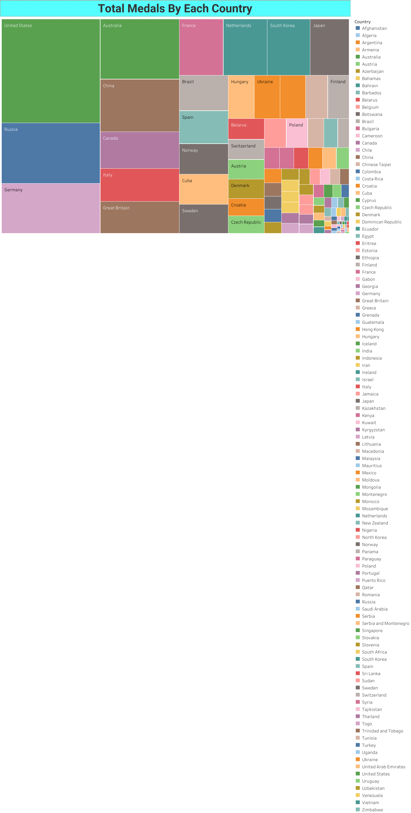

# **Data Visualization Projects Using Tableau**

This repository contains **Tableau visualizations** that analyze different datasets, including **Sales Data, World Bank Indicators, and Olympic Athletes' Data**.

## 📊 **Project Overview**

### **1️⃣ Sales Data Dashboard**
This dashboard visualizes **sales trends, product performance, and geographical distribution**.

#### 📈 **Task 1: Line Chart**  
- **Trend of sales over time**
- Uses the **Order Date** (x-axis) and **Sum of Sales** (y-axis).
- Includes a filter for selecting a product category.


#### 📊 **Task 2: Bar Chart**  
- **Total sales by product category**
- Uses the **Product Category** (x-axis) and **Sum of Sales** (y-axis).
- Bars are sorted in descending order.


#### 🔵 **Task 3: Scatter Plot**  
- **Relationship between Sales and Profit**
- X-axis: **Sales Measure**, Y-axis: **Profit Measure**.
- **Size of points** represents the **quantity of products sold**.


---

### **2️⃣ World Bank Indicators Dashboard**
This dashboard visualizes **global economic and social indicators**.

#### 🌍 **Task 1: World Map - Population**
- **Displays population count** for countries with **over 1 million people**.


#### 📊 **Task 2: Bar Chart - Mobile vs. Internet Users**  
- Compares **mobile users vs. internet users** in:
  - India
  - United Arab Emirates
  - United Kingdom
  - United States


#### 🔥 **Task 3: Heat Map - Life Expectancy**  
- **Top 10 countries** with the **highest life expectancy at birth**.


#### 🔵 **Task 4: Packed Bubble Chart - Railway Transit**  
- **Top 15 countries** with the highest **railway transit usage**.


---

### **3️⃣ Olympic Athletes Dashboard**
This dashboard analyzes **medal distributions across countries**.

#### 🥉 **Task 1: Horizontal Bar Chart - Bronze Medals**  
- Displays **bronze medals won** by each country.


#### 🏅 **Task 2: Packed Bubble Chart - Gold Medals**  
- Shows **gold medals obtained** by each country.


#### 🗺 **Task 3: Map Visualization - Silver Medals**  
- Displays **silver medals distribution worldwide**.


#### 🌲 **Task 4: Treemap - Total Medals**  
- Represents **total medals won** by each country.



---

## 💡 **How to View the Dashboards**
1. **Download the Tableau Public application** or open the `.twbx` file in Tableau.
2. **Upload the dataset** if required.
3. **Explore the dashboards** using filters and interactive charts.

---

## 🛠 **Tools Used**
- **Tableau** for data visualization
- **GitHub** for project documentation
- **Excel/CSV** for preprocessing data

---

## 📌 **How to Use This Repository**
1. Clone the repository:
   ```bash
   git clone https://github.com/DINAKAR-S/Data-Visualization-Projects-Using-Tableau.git
   ```
2. Open the Tableau files and explore the dashboards.
3. Modify or enhance the visualizations based on insights.

---

## 📢 **Contributing**
You can contribute by:
- Adding new datasets and visualizations.
- Improving dashboard interactivity.
- Reporting issues or suggestions.

---

## 📜 **License**
This project is licensed under the **MIT License**.

---

### 📷 **How to Upload Images to GitHub**
1. **Create an "images" folder** in your GitHub repository.
2. **Upload all image files** (`S_1.png`, `S_2.png`, `S_3.png`, `W_1.png`, etc.).
3. **Update the README.md** file to correctly reference the images.
4. **Commit and push changes**.

---

